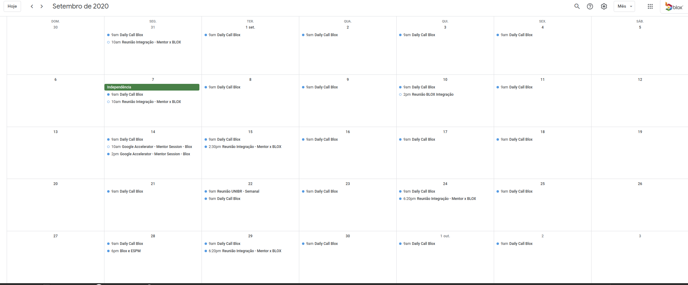

# Sobre a Empresa

Blox é uma EdTech que propõe uma abordagem radicalmente nova no ensino superior. Acreditamos que cada aluno é único e que portanto, sua trilha formativa também deveria ser única, personalizada às suas necessidades. Desenvolvemos todas as ferramentas e processos necessários para apoiar as universidades na verdadeira transformação da educação.

WebSite: https://blox.education

Youtube: https://www.youtube.com/channel/UCoU3Z5EheoYz3YQFRAaaeTw

# Sobre o teste

Este teste é apresentado às pessoas que estão se candidatando às vagas de desenvolvimento para avaliar os quesitos técnicos. 
O código deve ser escrito utilizando a linguagem Ruby + framework Rails.

### O Desafio

Seu objetivo é criar um web app simples no qual os usuários podem reservar salas de reunião.

### Pré-requisitos: 

- Deve ser possível criar, listar e excluir salas;
- Os horários disponíveis para reserva devem estar dentro do horário comercial (8:00 as 18:00);
- O usuário não conseguirá reservar a sala se a mesma já estiver alocada à outro usuário;
- Criação de uma tela de agenda onde usuários poderão visualizar / reservar todos os horários disponíveis;

### O que esperamos:

 - Testes, no mínimo testes unitários;
 - Utilização de versionamento de código (git);
 - Padrão de Projeto e boas práticas de Orientação a Objetos;
 - Criar uma documentação de como rodar sua aplicação;
 - Criar uma breve descrição da solução utilizada;

### Plus:

 - A página ser responsiva;
 - Utilizar React + Redux

### Entrega do desafio:

- O código deve ser disponibilizado no github ou bitbucket para avaliação.
- A aplicação deve ser deployada no heroku (https://devcenter.heroku.com/articles/getting-started-with-rails5)
